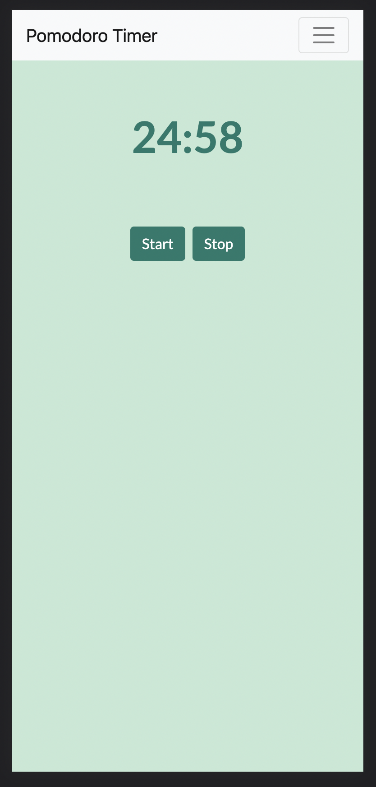

#Prompts
* please write me html, javascript and css to make a pomodoro timer with soothing visual elements
    * css cut off before it finished generating
* please rewrite the css and make it more soothing
* please add a modern font via google fonts and give it a nice mint theme
    * still not filling the whole page.
* please use the bootstrap framework to make it responsive and have a nice navigation bar
    * fills the page but old css not working anymore
* please give me just the css to add a nice mint theme to the bootstrap version
* the mint background is only applying to the container, and the container is not filling the page can you make it apply to the entire page?
* Result: got a nice (albeit feature limited) mobile responsive pomodoro timer.

